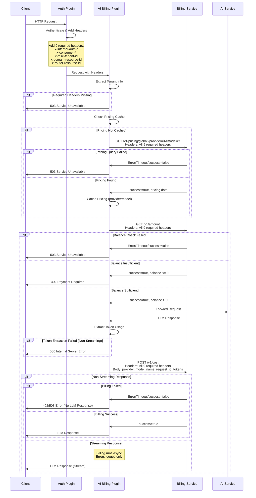

# Design Document: AI Billing Plugin

## Overview

AI Billing 插件是一个 Higress WASM 插件，用于在 AI 代理请求的生命周期中实现定价验证、余额检查和费用扣除。插件采用基于租户的计费模式，与独立的 billing-service 服务集成，通过 HMAC 签名验证确保请求的安全性。插件对非流式响应采用严格的 FAIL_CLOSE 策略，对流式响应采用异步计费策略。

插件的核心功能包括：
1. **租户信息提取**：从请求头中提取租户信息和 HMAC 认证头（由上游认证插件提供）
2. **模型定价查询**：在余额检查前验证模型定价信息已配置，支持内存缓存
3. **请求前余额检查**：在请求转发到 AI 服务之前，验证租户是否有足够的余额
4. **响应后费用扣除**：在 LLM 请求成功返回后，根据 token 使用量自动扣除费用
5. **多协议支持**：支持 OpenAI、Claude、Gemini 等多种 LLM 协议格式
6. **流式响应处理**：正确处理 SSE 流式响应场景下的计费
7. **差异化失败处理**：非流式响应采用 FAIL_CLOSE 策略，流式响应计费失败仅记录日志不阻断响应

## Architecture

### 插件执行流程



### 组件架构

```
┌─────────────────────────────────────────────────────────────┐
│                    AI Billing Plugin                         │
├─────────────────────────────────────────────────────────────┤
│                                                               │
│  ┌──────────────────┐  ┌──────────────────┐                │
│  │  Config Parser   │  │  Tenant Info     │                │
│  │                  │  │  Extractor       │                │
│  └──────────────────┘  └──────────────────┘                │
│                                                               │
│  ┌──────────────────┐  ┌──────────────────┐                │
│  │  Pricing Query   │  │  Pricing Cache   │                │
│  │  Handler         │  │  (provider:model)│                │
│  └──────────────────┘  └──────────────────┘                │
│                                                               │
│  ┌──────────────────┐  ┌──────────────────┐                │
│  │  Balance         │  │  Token Usage     │                │
│  │  Checker         │  │  Extractor       │                │
│  └──────────────────┘  └──────────────────┘                │
│                                                               │
│  ┌──────────────────┐  ┌──────────────────┐                │
│  │  Cost            │  │  Error           │                │
│  │  Deductor        │  │  Handler         │                │
│  └──────────────────┘  └──────────────────┘                │
│                                                               │
│  ┌──────────────────┐  ┌──────────────────┐                │
│  │  HTTP Client     │  │  Logger          │                │
│  │                  │  │                  │                │
│  └──────────────────┘  └──────────────────┘                │
│                                                               │
└─────────────────────────────────────────────────────────────┘
         │                                    │
         │ HTTP                               │ HTTP
         ▼                                    ▼
┌──────────────────┐              ┌──────────────────┐
│ Billing Service  │              │   AI Service     │
│  /v1/pricing/    │              │  (OpenAI, etc)   │
│    global        │              │                  │
│  /v1/amount      │              │                  │
│  /v1/cost        │              │                  │
└──────────────────┘              └──────────────────┘
```

## Components and Interfaces

### 1. Config Parser

**职责**：解析插件配置并验证配置的有效性

**接口**：
```go
type BillingConfig struct {
    BillingService             BillingServiceConfig
    FailPricingMessage         string
    FailBalanceMessage         string
    InsufficientBalanceMessage string
    FailCostMessage            string
    pricingCache               map[string]bool  // key: provider:model
}

type BillingServiceConfig struct {
    ServiceAddress string
    Protocol       string  // "http" or "https"
    Port           int
}

func parseConfig(json gjson.Result, config *BillingConfig) error
```

**行为**：
- 解析 YAML 配置中的所有字段
- 验证必需字段（serviceAddress）是否存在
- 为可选字段设置默认值
- 构建完整的服务 URL
- 初始化定价缓存 map

### 2. Tenant Info Extractor

**职责**：从请求头中提取租户信息和 HMAC 认证头

**接口**：
```go
type TenantInfo struct {
    // HMAC Authentication Headers
    SignVersion      string  // x-internal-auth-sign-version
    Timestamp        string  // x-internal-auth-ts
    Nonce            string  // x-internal-auth-nonce
    Signature        string  // x-internal-auth-sign
    
    // Tenant/Consumer Information
    ConsumerID       string  // x-consumer-id
    ConsumerName     string  // x-mse-consumer-name
    TenantID         string  // x-mse-tenant-id
    ConsumerApiKey   string  // x-mse-consumer-apikey
    DomainResourceID string  // x-domain-resource-id
    RouterResourceID string  // x-router-resource-id
}

func extractTenantInfo(ctx wrapper.HttpContext) (*TenantInfo, error)
```

**行为**：
- 从请求头中提取所有 10 个必需字段（包括 x-mse-consumer-apikey）
- 如果任何字段缺失，返回错误并记录缺失的字段名称
- 将租户信息存储在请求上下文中供后续使用
- 可选：尝试提取 API Key 用于 debug 日志（不影响主流程）

### 3. Pricing Query Handler

**职责**：查询模型定价信息并管理定价缓存

**接口**：
```go
type PricingRequest struct {
    Provider  string  // URL parameter
    ModelName string  // URL parameter
}

type PricingResponse struct {
    Success bool   `json:"success"`
    Message string `json:"message"`
    Data    struct {
        Provider  string  `json:"provider"`
        ModelName string  `json:"model_name"`
        // ... other pricing fields
    } `json:"data"`
}

func checkPricing(ctx wrapper.HttpContext, config BillingConfig, tenantInfo *TenantInfo, provider, model string) error
```

**行为**：
- 检查内存缓存中是否存在 provider:model 的定价信息
- 如果缓存命中，跳过查询直接返回成功
- 如果缓存未命中，向 Billing_Service 发送 GET 请求到 /v1/pricing/global
- 在请求头中包含所有租户信息和 HMAC 认证头
- 解析响应并检查 success 字段
- 如果成功，将定价信息存储到缓存中
- 如果失败，返回错误（优先使用 message 字段，否则使用配置的 failPricingMessage）

### 4. Balance Checker

**职责**：向 Billing Service 查询租户余额并验证是否足够

**接口**：
```go
type BalanceResponse struct {
    Success bool   `json:"success"`
    Message string `json:"message"`
    Balance string `json:"balance"`
    UID     int64  `json:"uid"`
}

func checkBalance(ctx wrapper.HttpContext, config BillingConfig, tenantInfo *TenantInfo) error
```

**行为**：
- 构建余额查询请求（GET /v1/amount）
- 在请求头中包含所有租户信息和 HMAC 认证头
- 不在请求体中包含任何数据（使用 GET 方法）
- 使用异步 HTTP 调用发送请求
- 解析响应并验证 success 字段和余额
- 根据余额决定是否允许请求继续
- 处理超时和错误情况（优先使用 message 字段，否则使用配置的错误消息）

### 5. Token Usage Extractor

**职责**：从 LLM 响应中提取 token 使用量和模型信息

**接口**：
```go
// 使用 wasm-go 包提供的 tokenusage.GetTokenUsage() 函数
// 该函数返回 tokenusage.TokenUsageInfo 结构体
type TokenUsageInfo struct {
    InputToken  int64
    OutputToken int64
    TotalToken  int64
    Model       string
}

func extractTokenUsage(ctx wrapper.HttpContext, data []byte) (*TokenUsageInfo, error)
func extractRequestID(ctx wrapper.HttpContext, data []byte) (string, error)
func extractProvider(ctx wrapper.HttpContext) (string, error)
```

**行为**：
- 使用 `tokenusage.GetTokenUsage(ctx, data)` 提取 token 信息
- 该函数自动处理多种协议格式（OpenAI/Claude/Gemini）
- 对于流式响应，每个数据块都调用该函数，最后一个包含 usage 的块会返回完整信息
- 单独提取 request_id（从响应的 id 字段）
- 从上下文或配置中获取 provider 信息
- 验证所有必需字段是否存在

### 6. Cost Deductor

**职责**：向 Billing Service 发送计费请求并处理响应

**接口**：
```go
type CostRequest struct {
    Provider     string `json:"provider"`
    ModelName    string `json:"model_name"`
    RequestID    string `json:"request_id"`
    InputTokens  int64  `json:"input_tokens"`
    OutputTokens int64  `json:"output_tokens"`
    // Note: consumer_id, consumer_name, tenant_id are in headers, not body
}

type CostResponse struct {
    Success          bool   `json:"success"`
    Message          string `json:"message"`
    BillingEventID   int64  `json:"billing_event_id"`
    Cost             string `json:"cost"`
    RemainingBalance string `json:"remaining_balance"`
}

func deductCost(ctx wrapper.HttpContext, config BillingConfig, tenantInfo *TenantInfo, usage *TokenUsage) error
func deductCostAsync(ctx wrapper.HttpContext, config BillingConfig, tenantInfo *TenantInfo, usage *TokenUsage)
```

**行为**：
- 构建计费请求（POST /v1/cost）
- 在请求头中包含所有租户信息和 HMAC 认证头
- 在请求体中包含 provider、model_name、request_id、input_tokens、output_tokens
- 不在请求体中包含 consumer_id、consumer_name、tenant_id（这些在请求头中）
- 使用异步 HTTP 调用发送请求
- 解析响应并检查 success 字段
- 对于非流式响应：根据计费结果决定是否返回 LLM 响应（FAIL_CLOSE）
- 对于流式响应：使用 deductCostAsync，计费失败只记录详细日志不阻断响应
- 处理超时和错误情况（优先使用 message 字段，否则使用配置的错误消息）

### 7. HTTP Client

**职责**：提供与 Billing Service 通信的 HTTP 客户端

**接口**：
```go
type BillingClient struct {
    cluster wrapper.HttpClient
    baseURL string
    timeout uint32
}

func NewBillingClient(config BillingServiceConfig) *BillingClient
func (c *BillingClient) GetPricing(provider, model string, headers [][2]string, callback wrapper.ResponseCallback) error
func (c *BillingClient) GetBalance(headers [][2]string, callback wrapper.ResponseCallback) error
func (c *BillingClient) DeductCost(request CostRequest, headers [][2]string, callback wrapper.ResponseCallback) error
```

**行为**：
- 使用 wrapper.ClusterClient 进行 HTTP 调用
- 设置合理的超时时间（5 秒）
- 复用 HTTP 连接
- 在所有请求中包含租户信息和 HMAC 认证头
- 处理网络错误和超时

### 8. Error Handler

**职责**：统一处理各种错误情况并返回适当的响应

**接口**：
```go
func sendErrorResponse(statusCode int, message string) error
func logError(ctx wrapper.HttpContext, component string, err error, details map[string]interface{})
```

**行为**：
- 根据错误类型返回适当的 HTTP 状态码
- 优先返回 billing-service 的 message 字段
- 如果 message 为空或请求失败，返回配置的错误消息
- 记录详细的错误日志（包含租户信息）
- 确保 API Key 仅在 debug 日志中被脱敏记录

### 9. Logger

**职责**：提供结构化日志记录功能

**接口**：
```go
func logPricingQuery(tenantInfo *TenantInfo, provider, model string, cached bool, success bool)
func logBalanceCheck(tenantInfo *TenantInfo, balance string, allowed bool)
func logCostDeduction(tenantInfo *TenantInfo, requestID string, usage *TokenUsage, cost string, success bool)
func logError(component string, err error, context map[string]interface{})
```

**行为**：
- 使用结构化日志格式
- Info 级别日志包含 tenant_id、consumer_id、consumer_name
- Debug 级别日志可包含脱敏的 API Key（仅前 8 个字符后跟 "***"）
- 记录关键操作的详细信息（定价查询、余额检查、费用扣除）
- 支持不同的日志级别（Debug、Info、Warn、Error）
- 流式响应计费失败时记录详细的错误日志

## Data Models

### Configuration Model

```go
type BillingConfig struct {
    BillingService             BillingServiceConfig `yaml:"billingService"`
    FailPricingMessage         string               `yaml:"failPricingMessage"`
    FailBalanceMessage         string               `yaml:"failBalanceMessage"`
    InsufficientBalanceMessage string               `yaml:"insufficientBalanceMessage"`
    FailCostMessage            string               `yaml:"failCostMessage"`
    pricingCache               map[string]bool      // key: provider:model
}

type BillingServiceConfig struct {
    ServiceAddress string `yaml:"serviceAddress"`
    Protocol       string `yaml:"protocol"`
    Port           int    `yaml:"port"`
    // Note: namespace field removed
}
```

### Tenant Information Model

```go
type TenantInfo struct {
    // HMAC Authentication Headers
    SignVersion      string  // x-internal-auth-sign-version
    Timestamp        string  // x-internal-auth-ts
    Nonce            string  // x-internal-auth-nonce
    Signature        string  // x-internal-auth-sign
    
    // Tenant/Consumer Information
    ConsumerID       string  // x-consumer-id
    ConsumerName     string  // x-mse-consumer-name
    TenantID         string  // x-mse-tenant-id
    DomainResourceID string  // x-domain-resource-id
    RouterResourceID string  // x-router-resource-id
}
```

### Request/Response Models

```go
// Pricing Query
type PricingRequest struct {
    Provider  string  // URL parameter
    ModelName string  // URL parameter
}

type PricingResponse struct {
    Success bool   `json:"success"`
    Message string `json:"message"`
    Data    struct {
        Provider  string `json:"provider"`
        ModelName string `json:"model_name"`
        // ... other pricing fields
    } `json:"data"`
}

// Balance Check (GET request, no body)
type BalanceResponse struct {
    Success bool   `json:"success"`
    Message string `json:"message"`
    Balance string `json:"balance"`
    UID     int64  `json:"uid"`
}

// Cost Deduction
type CostRequest struct {
    Provider     string `json:"provider"`
    ModelName    string `json:"model_name"`
    RequestID    string `json:"request_id"`
    InputTokens  int64  `json:"input_tokens"`
    OutputTokens int64  `json:"output_tokens"`
    // Note: consumer_id, consumer_name, tenant_id are in headers
}

type CostResponse struct {
    Success          bool   `json:"success"`
    Message          string `json:"message"`
    BillingEventID   int64  `json:"billing_event_id"`
    Cost             string `json:"cost"`
    RemainingBalance string `json:"remaining_balance"`
}
```

### Internal Models

```go
// 使用 wasm-go 包提供的 TokenUsageInfo
type TokenUsageInfo struct {
    InputToken  int64
    OutputToken int64
    TotalToken  int64
    Model       string
}

type BillingInfo struct {
    TokenUsage *TokenUsageInfo
    RequestID  string
    Provider   string
}

type ContextKeys struct {
    TenantInfo       *TenantInfo
    BillingInfo      *BillingInfo
    IsStreaming      bool
    ApiKey           string  // Optional, for debug logging only
}
```

## Correctness Properties

*A property is a characteristic or behavior that should hold true across all valid executions of a system-essentially, a formal statement about what the system should do. Properties serve as the bridge between human-readable specifications and machine-verifiable correctness guarantees.*

### Property 1: API Key Extraction Consistency

*For any* HTTP request with a valid API key in either `x-hi-original-auth` or `Authorization` header, the plugin should successfully extract the API key and store it in the request context.

**Validates: Requirements 2.1, 2.2, 2.3, 2.7**

### Property 2: Balance Check Enforcement

*For any* request with an API key, if the balance check returns a balance <= 0, the plugin should return 402 Payment Required and terminate the request without forwarding to the AI service.

**Validates: Requirements 3.5, 3.6, 3.7**

### Property 3: Balance Check Failure Handling

*For any* balance check request that fails (timeout, non-200 status, or network error), the plugin should return 503 Service Unavailable and terminate the request without forwarding to the AI service.

**Validates: Requirements 3.9, 3.10, 3.11, 3.12, 3.13, 3.14**

### Property 4: Successful Balance Check Pass-Through

*For any* request where the balance check returns a balance > 0, the plugin should allow the request to continue to the AI service.

**Validates: Requirements 3.8**

### Property 5: Token Usage Extraction from OpenAI Format

*For any* valid OpenAI protocol response (streaming or non-streaming), the plugin should successfully extract input_tokens, output_tokens, and model information from the usage object.

**Validates: Requirements 4.7, 4.8, 4.9, 11.1, 11.4**

### Property 6: Token Usage Extraction from Claude Format

*For any* valid Claude protocol response, the plugin should successfully extract input_tokens and output_tokens from the usage object.

**Validates: Requirements 4.7, 4.8, 11.2, 11.5**

### Property 7: Token Usage Extraction from Gemini Format

*For any* valid Gemini protocol response, the plugin should successfully extract promptTokenCount and candidatesTokenCount from the usageMetadata object.

**Validates: Requirements 4.7, 4.8, 11.3, 11.6**

### Property 8: Multi-Protocol Fallback

*For any* LLM response, if the plugin cannot extract token usage using the primary protocol format, it should attempt all known formats and use the first successful result.

**Validates: Requirements 11.7, 11.8**

### Property 9: Cost Deduction Success Pass-Through

*For any* cost deduction request where the billing service returns success=true, the plugin should allow the LLM response to be returned to the client.

**Validates: Requirements 5.5**

### Property 10: Cost Deduction Failure Blocking

*For any* cost deduction request where the billing service returns success=false, the plugin should return 402 Payment Required and not return the LLM response to the client.

**Validates: Requirements 5.6, 5.7, 5.8**

### Property 11: Cost Deduction Error Handling

*For any* cost deduction request that fails (timeout, non-200 status, or network error), the plugin should return 503 Service Unavailable and not return the LLM response to the client.

**Validates: Requirements 5.9, 5.10, 5.11, 5.12, 5.13, 5.14**

### Property 12: Streaming Response Token Extraction

*For any* streaming response, the plugin should call `tokenusage.GetTokenUsage()` on each data chunk, and when the function returns a non-zero TotalToken, use that as the final token usage.

**Validates: Requirements 6.1, 6.2, 6.3, 6.4, 6.5, 6.6**

### Property 13: API Key Masking in Logs

*For any* log entry containing an API key, the plugin should only include the first 8 characters followed by "***".

**Validates: Requirements 10.4**

### Property 14: No LLM Response on Billing Failure

*For any* request where billing fails (balance check or cost deduction), the plugin should ensure that the LLM response is never returned to the client.

**Validates: Requirements 10.7**

## Error Handling

### Error Categories

1. **Configuration Errors** (Startup)
   - Missing required configuration fields
   - Invalid configuration values
   - Action: Reject plugin startup

2. **Authentication Errors** (Request Phase)
   - Missing API Key
   - Invalid API Key format
   - Action: Return 401 Unauthorized

3. **Balance Check Errors** (Request Phase)
   - Billing service unavailable
   - Billing service timeout
   - Billing service returns error
   - Insufficient balance
   - Action: Return 503 or 402, terminate request

4. **Token Extraction Errors** (Response Phase)
   - Missing required fields
   - Invalid response format
   - Unsupported protocol
   - Action: Return 500 Internal Server Error, terminate request

5. **Cost Deduction Errors** (Response Phase)
   - Billing service unavailable
   - Billing service timeout
   - Billing service returns error
   - Billing returns success=false
   - Action: Return 503 or 402, do not return LLM response

### Error Response Format

All error responses follow this format:
```json
{
  "error": {
    "message": "<configured error message>",
    "type": "billing_error",
    "code": "<error_code>"
  }
}
```

### Error Logging

All errors are logged with the following information:
- Component name
- Error type
- Error message
- Request context (API key masked, request ID, etc.)
- Timestamp

## Testing Strategy

### Unit Testing

Unit tests will verify specific examples and edge cases:

1. **Configuration Parsing Tests**
   - Valid configuration with all fields
   - Configuration with default values
   - Invalid configuration (missing required fields)
   - Edge cases (empty strings, invalid port numbers)

2. **API Key Extraction Tests**
   - API key in x-hi-original-auth header
   - API key in Authorization header
   - API key with Bearer prefix
   - Missing API key
   - Empty API key

3. **Balance Check Tests**
   - Successful balance check with sufficient balance
   - Balance check with insufficient balance
   - Balance check timeout
   - Balance check with non-200 status
   - Balance check with invalid response format

4. **Token Extraction Tests**
   - OpenAI format (streaming and non-streaming)
   - Claude format
   - Gemini format
   - Missing required fields
   - Invalid JSON format

5. **Cost Deduction Tests**
   - Successful cost deduction
   - Cost deduction with success=false
   - Cost deduction timeout
   - Cost deduction with non-200 status
   - Cost deduction with invalid response format

6. **Error Handling Tests**
   - Each error category
   - Error response format
   - Error logging (with API key masking)

### Property-Based Testing

Property-based tests will verify universal properties across all inputs using a Go property-based testing library (e.g., `gopter` or `rapid`). Each test will run a minimum of 100 iterations.

**Test Configuration**:
- Library: `gopter` (https://github.com/leanovate/gopter)
- Iterations per test: 100
- Tag format: `// Feature: ai-billing, Property {number}: {property_text}`

**Property Tests**:

1. **Property Test 1: API Key Extraction Consistency**
   - Generate random HTTP requests with API keys in various headers
   - Verify that the plugin always extracts the API key correctly
   - Tag: `// Feature: ai-billing, Property 1: API Key Extraction Consistency`

2. **Property Test 2: Balance Check Enforcement**
   - Generate random balance check responses with balance <= 0
   - Verify that the plugin always returns 402 and terminates the request
   - Tag: `// Feature: ai-billing, Property 2: Balance Check Enforcement`

3. **Property Test 3: Balance Check Failure Handling**
   - Generate random balance check failures (timeouts, errors, non-200 status)
   - Verify that the plugin always returns 503 and terminates the request
   - Tag: `// Feature: ai-billing, Property 3: Balance Check Failure Handling`

4. **Property Test 4: Successful Balance Check Pass-Through**
   - Generate random balance check responses with balance > 0
   - Verify that the plugin always allows the request to continue
   - Tag: `// Feature: ai-billing, Property 4: Successful Balance Check Pass-Through`

5. **Property Test 5: Token Usage Extraction from OpenAI Format**
   - Generate random OpenAI format responses
   - Verify that the plugin always extracts token usage correctly
   - Tag: `// Feature: ai-billing, Property 5: Token Usage Extraction from OpenAI Format`

6. **Property Test 6: Token Usage Extraction from Claude Format**
   - Generate random Claude format responses
   - Verify that the plugin always extracts token usage correctly
   - Tag: `// Feature: ai-billing, Property 6: Token Usage Extraction from Claude Format`

7. **Property Test 7: Token Usage Extraction from Gemini Format**
   - Generate random Gemini format responses
   - Verify that the plugin always extracts token usage correctly
   - Tag: `// Feature: ai-billing, Property 7: Token Usage Extraction from Gemini Format`

8. **Property Test 8: Multi-Protocol Fallback**
   - Generate random LLM responses in various formats
   - Verify that the plugin always attempts all formats and uses the first successful result
   - Tag: `// Feature: ai-billing, Property 8: Multi-Protocol Fallback`

9. **Property Test 9: Cost Deduction Success Pass-Through**
   - Generate random cost deduction responses with success=true
   - Verify that the plugin always allows the LLM response to be returned
   - Tag: `// Feature: ai-billing, Property 9: Cost Deduction Success Pass-Through`

10. **Property Test 10: Cost Deduction Failure Blocking**
    - Generate random cost deduction responses with success=false
    - Verify that the plugin always returns 402 and does not return the LLM response
    - Tag: `// Feature: ai-billing, Property 10: Cost Deduction Failure Blocking`

11. **Property Test 11: Cost Deduction Error Handling**
    - Generate random cost deduction failures (timeouts, errors, non-200 status)
    - Verify that the plugin always returns 503 and does not return the LLM response
    - Tag: `// Feature: ai-billing, Property 11: Cost Deduction Error Handling`

12. **Property Test 12: Streaming Response Token Extraction**
    - Generate random streaming responses with usage information in different chunks
    - Verify that the plugin correctly extracts token usage using `tokenusage.GetTokenUsage()`
    - Tag: `// Feature: ai-billing, Property 12: Streaming Response Token Extraction`

13. **Property Test 13: API Key Masking in Logs**
    - Generate random API keys
    - Verify that logs always contain only the first 8 characters followed by "***"
    - Tag: `// Feature: ai-billing, Property 13: API Key Masking in Logs`

14. **Property Test 14: No LLM Response on Billing Failure**
    - Generate random billing failures
    - Verify that the plugin never returns the LLM response to the client
    - Tag: `// Feature: ai-billing, Property 14: No LLM Response on Billing Failure`

### Integration Testing

Integration tests will verify the plugin's interaction with:
1. Billing Service (using mock server)
2. AI Service (using mock server)
3. Higress gateway (using test framework)

### Performance Testing

Performance tests will verify:
1. Latency overhead (should be < 50ms for balance check + cost deduction)
2. Throughput (should handle 1000+ requests/second)
3. Memory usage (should be < 10MB per request)
4. Connection pooling effectiveness

## Implementation Notes

### WASM Plugin Lifecycle

The plugin follows the standard Higress WASM plugin lifecycle:

1. **Initialization** (`init()`)
   - Register plugin with wrapper.SetCtx
   - Set up configuration parser
   - Set up request/response handlers

2. **Configuration Parsing** (`parseConfig()`)
   - Parse YAML configuration
   - Validate configuration
   - Initialize HTTP client
   - Initialize pricing cache map

3. **Request Processing**
   - `onHttpRequestHeaders()`: Extract tenant info, check pricing (with cache), check balance
   - `onHttpRequestBody()`: Not used (余额检查不需要读取请求体)

4. **Response Processing**
   - `onHttpResponseHeaders()`: Check response status, detect streaming
   - `onHttpResponseBody()`: Extract token usage using `tokenusage.GetTokenUsage()`, deduct cost (non-streaming, FAIL_CLOSE)
   - `onHttpStreamingResponseBody()`: Call `tokenusage.GetTokenUsage()` on each chunk, deduct cost async when TotalToken > 0 (streaming, log errors only)

### Key Implementation Details from ai-statistics

Based on the ai-statistics plugin implementation, the following patterns should be followed:

1. **Token Usage Extraction**:
   ```go
   // For both streaming and non-streaming responses
   if usage := tokenusage.GetTokenUsage(ctx, data); usage.TotalToken > 0 {
       // Store token usage in context
       ctx.SetContext(tokenusage.CtxKeyInputToken, usage.InputToken)
       ctx.SetContext(tokenusage.CtxKeyOutputToken, usage.OutputToken)
       ctx.SetContext(tokenusage.CtxKeyModel, usage.Model)
       // Trigger billing
   }
   ```

2. **Streaming Response Handling**:
   - Call `tokenusage.GetTokenUsage()` on each chunk
   - The function returns TotalToken > 0 only when usage information is present
   - Typically, usage information appears in the last chunk of streaming responses
   - No need to manually buffer all chunks

3. **Response Type Detection**:
   ```go
   contentType, _ := proxywasm.GetHttpResponseHeader("content-type")
   if strings.Contains(contentType, "text/event-stream") {
       // Streaming response - don't buffer
   } else {
       // Non-streaming response - buffer
       ctx.BufferResponseBody()
   }
   ```

4. **Request ID Extraction**:
   ```go
   // Use wrapper.GetValueFromBody() for flexible field extraction
   if requestID := wrapper.GetValueFromBody(data, []string{
       "id",
       "response.id",
       "responseId",
       "message.id",
   }); requestID != nil {
       // Use requestID.String()
   }
   ```

5. **Provider Information**:
   - Provider can be extracted from route name or cluster name
   - Use `proxywasm.GetProperty([]string{"route_name"})` or `proxywasm.GetProperty([]string{"cluster_name"})`
   - Or store in plugin configuration

6. **Async HTTP Call Pattern**:
   ```go
   client := wrapper.NewClusterClient(wrapper.DnsCluster{
       ServiceName: config.BillingService.ServiceAddress,
       Port:        int64(config.BillingService.Port),
   })
   
   err := client.Post(url, headers, body, func(statusCode int, responseHeaders http.Header, responseBody []byte) {
       // Handle response in callback
       if statusCode == 200 {
           // Parse response and continue
           proxywasm.ResumeHttpRequest() // or ResumeHttpResponse()
       } else {
           // Send error response
           util.SendResponse(statusCode, "error", "text/plain", message)
       }
   }, 5000) // 5 second timeout
   
   if err != nil {
       // Handle error
       return types.ActionContinue
   }
   
   // Pause processing until callback completes
   return types.ActionPause
   ```

7. **Error Response Pattern**:
   ```go
   func sendErrorResponse(statusCode int, errorType string, message string) {
       util.SendResponse(statusCode, errorType, "application/json", 
           fmt.Sprintf(`{"error":{"message":"%s","type":"billing_error"}}`, message))
   }
   ```

8. **Context Usage**:
   - Use `ctx.SetContext()` for internal state
   - Use `ctx.SetUserAttribute()` for logging/metrics
   - Use `ctx.GetContext()` with type assertion for retrieval

9. **Logging Best Practices**:
   ```go
   // Mask API key in logs
   maskedKey := apiKey
   if len(apiKey) > 8 {
       maskedKey = apiKey[:8] + "***"
   }
   log.Infof("[aiBilling] balance check: apikey=%s balance=%s", maskedKey, balance)
   log.Infof("[aiBilling] cost deduction: apikey=%s requestId=%s inputTokens=%d outputTokens=%d cost=%s", 
       maskedKey, requestID, inputTokens, outputTokens, cost)
   log.Errorf("[aiBilling] balance check failed: apikey=%s error=%v", maskedKey, err)
   ```

10. **Skip Processing Pattern**:
    ```go
    // In onHttpRequestHeaders
    if shouldSkip {
        ctx.DontReadRequestBody()
        ctx.DontReadResponseBody()
        return types.ActionContinue
    }
    ```

### Context Management

The plugin uses the request context to store:
- Tenant Info (TenantInfo struct)
- Billing Info (Token Usage, Request ID, Provider)
- Streaming state
- API Key (optional, for debug logging only)

Context keys:
```go
const (
    CtxKeyTenantInfo    = "ai-billing-tenant-info"
    CtxKeyBillingInfo   = "ai-billing-info"
    CtxKeyIsStreaming   = "ai-billing-is-streaming"
    CtxKeyApiKey        = "ai-billing-api-key"  // Optional, debug only
    CtxKeyRequestDenied = "ai-billing-request-denied"
)
```

**Note**: 不需要缓冲流式响应数据，因为 `tokenusage.GetTokenUsage()` 可以处理每个数据块。

### HTTP Client Configuration

The plugin uses `wrapper.ClusterClient` for HTTP calls:
- Cluster name: Constructed from service address
- Timeout: 5000ms (5 seconds)
- Connection pooling: Enabled by default

### Logging Strategy

The plugin uses structured logging with the following levels:
- **Debug**: Detailed execution flow, including masked API keys
- **Info**: Successful operations (pricing query, balance check, cost deduction) with tenant information
- **Warn**: Recoverable errors
- **Error**: Unrecoverable errors that terminate the request

Log format:
```
[aiBilling] [component] message key1=value1 key2=value2
```

Examples:
```
[aiBilling] pricing query: tenantId=1001 consumerId=123 consumerName=user1 provider=openai model=gpt-4 cached=true
[aiBilling] balance check: tenantId=1001 consumerId=123 consumerName=user1 balance=100.50
[aiBilling] cost deduction: tenantId=1001 consumerId=123 consumerName=user1 requestId=req-123 inputTokens=100 outputTokens=200 cost=0.05
[aiBilling] balance check failed: tenantId=1001 consumerId=123 consumerName=user1 error=timeout
[aiBilling] [DEBUG] API key extracted: apikey=abc12345***
```

### Performance Considerations

1. **Async HTTP Calls**: All HTTP calls to the billing service are asynchronous to avoid blocking the main request flow
2. **Connection Pooling**: HTTP connections are reused to reduce overhead
3. **No Unnecessary Buffering**: For streaming responses, use `tokenusage.GetTokenUsage()` on each chunk without buffering all data
4. **Efficient JSON Parsing**: Use `gjson` for fast JSON parsing without full deserialization
5. **Context Reuse**: Reuse context objects to reduce memory allocation
6. **Early Termination**: Terminate requests as soon as billing failures are detected

### Security Considerations

1. **API Key Protection**: API keys are never logged in full, only the first 8 characters
2. **HTTPS Support**: The plugin supports HTTPS for communication with the billing service
3. **Input Validation**: All inputs from the billing service are validated before use
4. **No Response Leakage**: LLM responses are never returned to the client if billing fails
5. **Timeout Protection**: All HTTP calls have timeouts to prevent resource exhaustion
