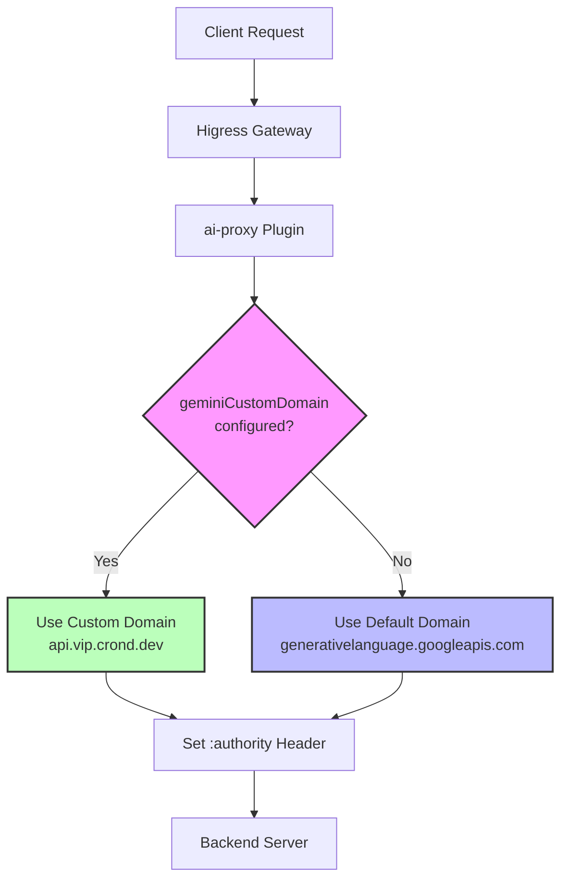
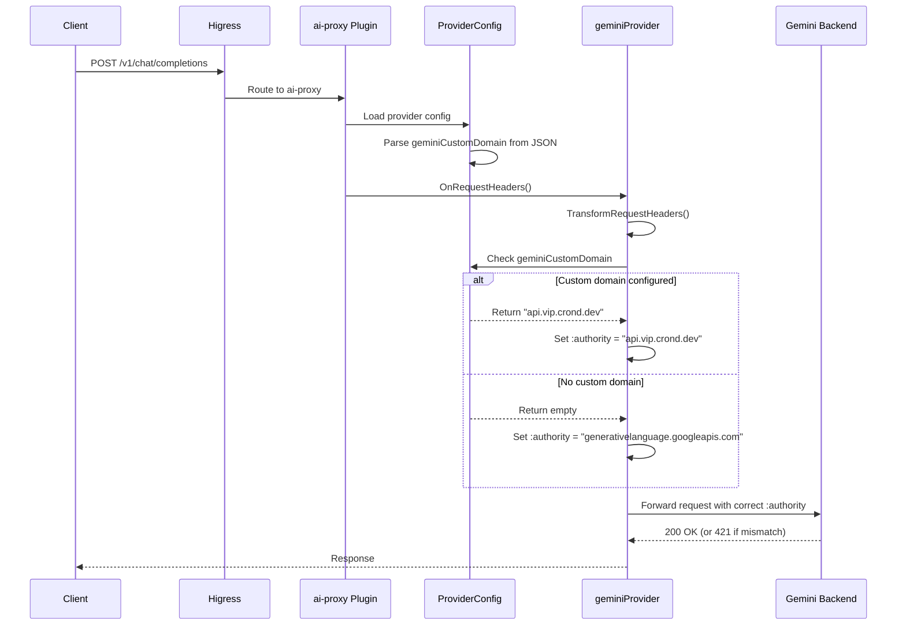

# Design Document: Gemini Custom Domain Configuration Support

## Overview

This feature adds support for configuring a custom domain for Gemini API requests in the ai-proxy plugin. The default Gemini domain is `generativelanguage.googleapis.com`, but users may need to route requests through custom backend domains (e.g., `api.vip.crond.dev`) that proxy or mirror the Gemini API. This configuration allows users to maintain the Gemini protocol (`type: gemini`, `protocol: original`) while directing requests to alternative backend endpoints.

The feature solves the HTTP/2 421 Misdirected Request error that occurs when the `:authority` header (HTTP/2 equivalent of the `Host` header) doesn't match the backend server's expected domain. This header is critical for virtual host routing and TLS SNI verification.

## Architecture



## Main Algorithm/Workflow



## Components and Interfaces

### Component 1: ProviderConfig

**Purpose**: Stores and manages provider configuration including the new `geminiCustomDomain` field.

**Interface**:
```go
type ProviderConfig struct {
    // ... existing fields ...
    
    // @Title zh-CN Gemini 自定义域名
    // @Description zh-CN 仅适用于 Gemini AI 服务。用于指定自定义的 Gemini 服务域名，默认为 generativelanguage.googleapis.com
    geminiCustomDomain string `required:"false" yaml:"geminiCustomDomain" json:"geminiCustomDomain"`
    
    // ... other fields ...
}

// FromJson parses configuration from JSON
func (c *ProviderConfig) FromJson(json gjson.Result)
```

**Responsibilities**:
- Store the `geminiCustomDomain` configuration value
- Parse `geminiCustomDomain` from JSON/YAML configuration
- Provide access to the custom domain value for geminiProvider

**Current Implementation Status**:
- ✅ Field defined in struct with proper annotations
- ❌ **Missing**: Parsing logic in `FromJson` method (needs to be added after line 537)

### Component 2: geminiProvider

**Purpose**: Handles Gemini-specific request transformations and applies the custom domain configuration.

**Interface**:
```go
type geminiProvider struct {
    config       ProviderConfig
    contextCache *contextCache
    client       wrapper.HttpClient
}

// TransformRequestHeaders modifies request headers before forwarding
func (g *geminiProvider) TransformRequestHeaders(
    ctx wrapper.HttpContext, 
    apiName ApiName, 
    headers http.Header
)
```

**Responsibilities**:
- Check if `geminiCustomDomain` is configured
- Apply custom domain to `:authority` header if configured
- Fall back to default domain if not configured
- Set API key header and clear authorization header

**Current Implementation Status**:
- ✅ Logic implemented in `TransformRequestHeaders` method (lines 93-99 in gemini.go)

## Data Models

### Configuration Model

```go
// Provider configuration in YAML/JSON
type GeminiProviderConfig struct {
    ID                 string   `yaml:"id" json:"id"`
    Type               string   `yaml:"type" json:"type"`                     // "gemini"
    ApiTokens          []string `yaml:"apiTokens" json:"apiTokens"`
    Protocol           string   `yaml:"protocol" json:"protocol"`             // "original"
    GeminiCustomDomain string   `yaml:"geminiCustomDomain" json:"geminiCustomDomain"` // Optional
}
```

**Validation Rules**:
- `geminiCustomDomain` is optional (empty string is valid)
- If provided, should be a valid domain name (no protocol prefix)
- Only applies when `type: gemini`
- Works with both `protocol: openai` and `protocol: original`

### Example Configuration

```yaml
providers:
  - id: gemini-custom
    type: gemini
    apiTokens:
      - "your-api-key"
    protocol: original
    geminiCustomDomain: "api.vip.crond.dev"  # Custom domain
```

```yaml
providers:
  - id: gemini-default
    type: gemini
    apiTokens:
      - "your-api-key"
    protocol: original
    # geminiCustomDomain not set - uses default
```

## Algorithmic Pseudocode

### Main Processing Algorithm

```pascal
ALGORITHM TransformRequestHeaders(ctx, apiName, headers)
INPUT: ctx (HttpContext), apiName (ApiName), headers (http.Header)
OUTPUT: Modified headers with correct :authority

BEGIN
  // Step 1: Determine target domain
  domain ← geminiDomain  // Default: "generativelanguage.googleapis.com"
  
  IF config.geminiCustomDomain ≠ "" THEN
    domain ← config.geminiCustomDomain
  END IF
  
  // Step 2: Apply domain to headers
  CALL OverwriteRequestHostHeader(headers, domain)
  
  // Step 3: Set authentication headers
  apiKey ← config.GetApiTokenInUse(ctx)
  headers.Set("x-goog-api-key", apiKey)
  
  // Step 4: Clear authorization header
  CALL OverwriteRequestAuthorizationHeader(headers, "")
  
  RETURN headers
END
```

**Preconditions**:
- `config` is initialized and valid
- `headers` is a valid http.Header object
- `ctx` contains valid HttpContext

**Postconditions**:
- `:authority` header is set to custom domain OR default domain
- `x-goog-api-key` header is set with valid API token
- `Authorization` header is cleared
- Original headers object is modified in-place

**Loop Invariants**: N/A (no loops in this algorithm)

### Configuration Parsing Algorithm

```pascal
ALGORITHM ParseGeminiCustomDomain(json)
INPUT: json (gjson.Result) - JSON configuration object
OUTPUT: geminiCustomDomain field populated in ProviderConfig

BEGIN
  // Parse geminiThinkingBudget (existing)
  config.geminiThinkingBudget ← json.Get("geminiThinkingBudget").Int()
  
  // Parse geminiCustomDomain (NEW - to be added)
  config.geminiCustomDomain ← json.Get("geminiCustomDomain").String()
  
  // Continue with other fields...
  config.vertexRegion ← json.Get("vertexRegion").String()
  config.vertexProjectId ← json.Get("vertexProjectId").String()
  
  RETURN config
END
```

**Preconditions**:
- `json` is a valid gjson.Result object
- `config` is initialized ProviderConfig struct

**Postconditions**:
- `config.geminiCustomDomain` contains the parsed value (empty string if not present)
- No validation errors (empty string is valid)
- Configuration is ready for use by geminiProvider

**Loop Invariants**: N/A (no loops in this algorithm)

## Key Functions with Formal Specifications

### Function 1: TransformRequestHeaders()

```go
func (g *geminiProvider) TransformRequestHeaders(
    ctx wrapper.HttpContext, 
    apiName ApiName, 
    headers http.Header
)
```

**Preconditions:**
- `g.config` is initialized and contains valid configuration
- `headers` is a non-nil http.Header map
- `ctx` is a valid HttpContext with request context data
- `apiName` is a valid ApiName constant

**Postconditions:**
- `:authority` header (or `Host` header) is set to either:
  - `g.config.geminiCustomDomain` if non-empty, OR
  - `geminiDomain` constant ("generativelanguage.googleapis.com") if empty
- `x-goog-api-key` header is set with a valid API token from config
- `Authorization` header is cleared (set to empty string)
- `headers` parameter is modified in-place
- No errors are returned (function has no return value)

**Loop Invariants:** N/A (no loops)

**Side Effects:**
- Modifies the `headers` parameter in-place
- May call `GetApiTokenInUse(ctx)` which could modify context state

### Function 2: FromJson() - geminiCustomDomain parsing

```go
func (c *ProviderConfig) FromJson(json gjson.Result)
```

**Preconditions:**
- `json` is a valid gjson.Result containing provider configuration
- `c` is an initialized (but possibly empty) ProviderConfig struct
- JSON structure matches expected provider configuration schema

**Postconditions:**
- `c.geminiCustomDomain` is set to the value from `json.Get("geminiCustomDomain").String()`
- If "geminiCustomDomain" key doesn't exist in JSON, field is set to empty string
- All other configuration fields are also parsed and populated
- No validation errors occur (empty string is valid for optional field)
- Configuration is ready for use by provider implementations

**Loop Invariants:** 
- For configuration array parsing loops: All previously parsed items remain valid
- Configuration state remains consistent throughout parsing

**Side Effects:**
- Modifies all fields of the `ProviderConfig` struct
- May allocate memory for slices and maps
- May set default values for missing optional fields

## Example Usage

### Example 1: Basic Usage with Custom Domain

```yaml
# Configuration file
providers:
  - id: gemini-custom-backend
    type: gemini
    apiTokens:
      - "AIzaSyXXXXXXXXXXXXXXXXXXXXXXXXXXXXXXX"
    protocol: original
    geminiCustomDomain: "api.vip.crond.dev"
```

**Request Flow:**
```
Client Request → Higress Gateway → ai-proxy Plugin
  ↓
geminiProvider.TransformRequestHeaders()
  ↓
Check: config.geminiCustomDomain = "api.vip.crond.dev" (non-empty)
  ↓
Set: :authority = "api.vip.crond.dev"
  ↓
Forward to: https://api.vip.crond.dev/v1beta/models/gemini-pro:generateContent
```

### Example 2: Default Behavior (No Custom Domain)

```yaml
# Configuration file
providers:
  - id: gemini-default
    type: gemini
    apiTokens:
      - "AIzaSyXXXXXXXXXXXXXXXXXXXXXXXXXXXXXXX"
    protocol: original
    # geminiCustomDomain not specified
```

**Request Flow:**
```
Client Request → Higress Gateway → ai-proxy Plugin
  ↓
geminiProvider.TransformRequestHeaders()
  ↓
Check: config.geminiCustomDomain = "" (empty)
  ↓
Set: :authority = "generativelanguage.googleapis.com" (default)
  ↓
Forward to: https://generativelanguage.googleapis.com/v1beta/models/gemini-pro:generateContent
```

### Example 3: Error Scenario - 421 Misdirected Request

**Before Fix (Hardcoded Domain):**
```
Configuration: Backend = api.vip.crond.dev
Actual :authority header = generativelanguage.googleapis.com (hardcoded)
Backend Response: 421 Misdirected Request
Reason: Host header mismatch
```

**After Fix (Custom Domain):**
```
Configuration: geminiCustomDomain = api.vip.crond.dev
Actual :authority header = api.vip.crond.dev (from config)
Backend Response: 200 OK
Reason: Host header matches backend expectation
```

## Correctness Properties

### Property 1: Domain Selection Correctness
**Universal Quantification:**
```
∀ config ∈ ProviderConfig, headers ∈ http.Header:
  IF config.geminiCustomDomain ≠ "" THEN
    headers[":authority"] = config.geminiCustomDomain
  ELSE
    headers[":authority"] = "generativelanguage.googleapis.com"
```

**Verification Method:** Unit test with both empty and non-empty `geminiCustomDomain` values

### Property 2: Configuration Parsing Idempotence
**Universal Quantification:**
```
∀ json ∈ gjson.Result:
  LET config1 = ParseConfig(json)
  LET config2 = ParseConfig(json)
  THEN config1.geminiCustomDomain = config2.geminiCustomDomain
```

**Verification Method:** Parse same configuration multiple times and verify consistency

### Property 3: Backward Compatibility
**Universal Quantification:**
```
∀ config ∈ ProviderConfig WHERE config.geminiCustomDomain = "":
  Behavior(config) = Behavior(config_before_feature)
```

**Verification Method:** Test existing configurations without `geminiCustomDomain` field

### Property 4: Header Overwrite Atomicity
**Universal Quantification:**
```
∀ headers ∈ http.Header, domain ∈ string:
  TransformRequestHeaders(ctx, apiName, headers) ⟹
    (headers[":authority"] = domain) ∧
    (headers["x-goog-api-key"] ≠ "") ∧
    (headers["Authorization"] = "")
```

**Verification Method:** Inspect headers after transformation to verify all three conditions

## Error Handling

### Error Scenario 1: Missing geminiCustomDomain in JSON

**Condition**: Configuration JSON doesn't include `geminiCustomDomain` field
**Response**: Field is set to empty string (default value)
**Recovery**: System uses default domain `generativelanguage.googleapis.com`
**Impact**: No error, backward compatible behavior

### Error Scenario 2: Invalid Domain Format

**Condition**: User provides invalid domain (e.g., with protocol prefix "https://api.example.com")
**Response**: Currently no validation - value is used as-is
**Recovery**: Backend may return error, but plugin doesn't validate
**Impact**: Request may fail at backend level
**Recommendation**: Consider adding domain validation in future enhancement

### Error Scenario 3: Backend Domain Mismatch

**Condition**: Custom domain doesn't match actual backend server configuration
**Response**: Backend returns 421 Misdirected Request
**Recovery**: User must correct configuration
**Impact**: Request fails, user sees error response
**Mitigation**: Clear documentation and configuration examples

### Error Scenario 4: Empty API Token

**Condition**: `apiTokens` array is empty or not configured
**Response**: Handled by existing validation in `ValidateConfig()`
**Recovery**: Configuration validation fails during plugin initialization
**Impact**: Plugin fails to start with clear error message

## Testing Strategy

### Unit Testing Approach

**Test Coverage Goals**: 90%+ coverage for new code paths

**Key Test Cases**:

1. **Test: Custom Domain Applied**
   - Setup: Configure `geminiCustomDomain = "api.custom.com"`
   - Action: Call `TransformRequestHeaders()`
   - Assert: `:authority` header equals "api.custom.com"

2. **Test: Default Domain Used**
   - Setup: Leave `geminiCustomDomain` empty
   - Action: Call `TransformRequestHeaders()`
   - Assert: `:authority` header equals "generativelanguage.googleapis.com"

3. **Test: Configuration Parsing**
   - Setup: JSON with `geminiCustomDomain: "test.domain.com"`
   - Action: Call `FromJson()`
   - Assert: `config.geminiCustomDomain` equals "test.domain.com"

4. **Test: Configuration Parsing - Missing Field**
   - Setup: JSON without `geminiCustomDomain` field
   - Action: Call `FromJson()`
   - Assert: `config.geminiCustomDomain` equals ""

5. **Test: Backward Compatibility**
   - Setup: Old configuration without `geminiCustomDomain`
   - Action: Parse and use configuration
   - Assert: No errors, default behavior maintained

### Property-Based Testing Approach

**Property Test Library**: QuickCheck (Go) or similar

**Property Tests**:

1. **Property: Domain Selection Determinism**
   - Generate: Random `geminiCustomDomain` values (including empty)
   - Invariant: Same input always produces same `:authority` header
   - Verify: Multiple calls with same config produce identical results

2. **Property: Configuration Round-Trip**
   - Generate: Random valid configurations
   - Invariant: JSON → Parse → JSON produces equivalent configuration
   - Verify: `geminiCustomDomain` value preserved through serialization

3. **Property: Header Modification Completeness**
   - Generate: Random initial header states
   - Invariant: After transformation, all three headers are set correctly
   - Verify: `:authority`, `x-goog-api-key`, and `Authorization` headers

### Integration Testing Approach

**Integration Test Scenarios**:

1. **End-to-End Test with Custom Domain**
   - Setup: Deploy plugin with custom domain configuration
   - Action: Send real request through Higress gateway
   - Verify: Request reaches backend with correct `:authority` header
   - Verify: Backend responds successfully (200 OK)

2. **End-to-End Test with Default Domain**
   - Setup: Deploy plugin without custom domain
   - Action: Send request to official Gemini API
   - Verify: Request succeeds with default domain

3. **Error Scenario Test**
   - Setup: Configure mismatched custom domain
   - Action: Send request
   - Verify: Backend returns 421 error
   - Verify: Error is properly propagated to client

## Performance Considerations

**Performance Impact**: Minimal

- **Configuration Parsing**: One-time cost during plugin initialization
  - Adding one string field to `FromJson()` has negligible impact
  - No additional allocations beyond single string copy

- **Request Processing**: No measurable overhead
  - Domain selection is a simple string comparison (`if domain != ""`)
  - Header overwrite is existing operation, just with different value
  - No additional network calls or I/O operations

- **Memory Usage**: Negligible increase
  - One additional string field per ProviderConfig instance
  - Typical size: 20-50 bytes per configuration
  - Total impact: < 1KB for typical deployments

**Optimization Notes**:
- No optimization needed - feature is already minimal
- String comparison and assignment are O(1) operations
- No loops or recursive operations introduced

## Security Considerations

**Security Impact**: Low risk, with considerations

### Threat 1: Domain Hijacking

**Risk**: User configures malicious custom domain
**Mitigation**: 
- User must have access to modify plugin configuration (admin-level)
- API key is still required for authentication
- TLS certificate validation still applies
**Recommendation**: Document that custom domains should be trusted

### Threat 2: Information Disclosure

**Risk**: Requests sent to unintended backend could leak API keys
**Mitigation**:
- API key is sent via `x-goog-api-key` header (standard Gemini auth)
- TLS encryption protects credentials in transit
- User controls custom domain configuration
**Recommendation**: Warn users to only use trusted custom domains

### Threat 3: Configuration Injection

**Risk**: Malicious JSON could inject unexpected domain values
**Mitigation**:
- Configuration is parsed by trusted gjson library
- No code execution or command injection possible
- Domain value is used as-is in header (no interpretation)
**Recommendation**: Standard configuration validation applies

### Threat 4: Bypass of Access Controls

**Risk**: Custom domain could bypass network policies
**Mitigation**:
- Network policies should be applied at infrastructure level
- Plugin respects configured routing rules
- No privilege escalation possible
**Recommendation**: Network admins should review custom domain configurations

**Security Best Practices**:
1. Only allow trusted administrators to modify plugin configuration
2. Use custom domains only for verified, trusted backends
3. Ensure TLS is enabled for all custom domain endpoints
4. Monitor and audit custom domain configuration changes
5. Document security implications in user-facing documentation

## Dependencies

**External Dependencies**: None (uses existing libraries)

- `github.com/higress-group/proxy-wasm-go-sdk` - Existing dependency for header manipulation
- `github.com/tidwall/gjson` - Existing dependency for JSON parsing
- `net/http` - Standard library for HTTP header types

**Internal Dependencies**:

- `util.OverwriteRequestHostHeader()` - Existing utility function
- `util.OverwriteRequestAuthorizationHeader()` - Existing utility function
- `ProviderConfig.GetApiTokenInUse()` - Existing method

**Version Requirements**: No new version requirements

**Compatibility**: 
- Backward compatible with existing configurations
- No breaking changes to API or behavior
- Works with all existing Gemini provider features

## Implementation Checklist

**Code Changes Required**:

- [x] Add `geminiCustomDomain` field to `ProviderConfig` struct (DONE)
- [ ] Add parsing logic in `ProviderConfig.FromJson()` method (MISSING)
- [x] Implement domain selection in `geminiProvider.TransformRequestHeaders()` (DONE)

**Missing Implementation**:

In `plugins/wasm-go/extensions/ai-proxy/provider/provider.go`, add after line 537:

```go
c.geminiThinkingBudget = json.Get("geminiThinkingBudget").Int()
c.geminiCustomDomain = json.Get("geminiCustomDomain").String()  // ADD THIS LINE
c.vertexRegion = json.Get("vertexRegion").String()
```

**Testing Requirements**:
- [ ] Unit tests for `TransformRequestHeaders()` with custom domain
- [ ] Unit tests for `TransformRequestHeaders()` with default domain
- [ ] Unit tests for `FromJson()` parsing
- [ ] Integration test with real custom backend
- [ ] Backward compatibility test

**Documentation Requirements**:
- [ ] Update plugin README with `geminiCustomDomain` configuration
- [ ] Add configuration examples
- [ ] Document use cases and limitations
- [ ] Add troubleshooting guide for 421 errors

## Limitations and Notes

**Known Limitations**:

1. **No Domain Validation**: Plugin doesn't validate domain format
   - User could provide invalid domain (e.g., with protocol prefix)
   - Backend will return error if domain is invalid
   - Future enhancement: Add domain format validation

2. **No DNS Resolution**: Plugin doesn't verify domain is resolvable
   - User must ensure custom domain is accessible
   - Network connectivity issues will cause request failures
   - Future enhancement: Add optional domain health check

3. **Single Domain Per Provider**: One custom domain per provider configuration
   - Cannot load-balance across multiple custom domains
   - Workaround: Configure multiple provider instances
   - Future enhancement: Support domain array for load balancing

4. **No Path Modification**: Only domain is customizable, not path structure
   - Gemini API path structure is preserved
   - Custom backend must support Gemini API paths
   - Future enhancement: Add path rewriting capability

**Usage Recommendations**:

1. **Verify Backend Compatibility**: Ensure custom domain supports Gemini protocol
2. **Test Configuration**: Test with simple request before production use
3. **Monitor Errors**: Watch for 421 errors indicating domain mismatch
4. **Use TLS**: Always use HTTPS for custom domains to protect API keys
5. **Document Custom Domains**: Maintain documentation of custom domain purposes

**Design Decisions**:

1. **Optional Field**: Made `geminiCustomDomain` optional to maintain backward compatibility
2. **No Validation**: Deferred domain validation to keep implementation simple
3. **String Type**: Used simple string type instead of URL type for flexibility
4. **Empty String Default**: Empty string means "use default domain" (clear semantics)
5. **No Protocol Prefix**: Domain should not include "https://" (consistent with other domain configs)

## Future Enhancements

**Potential Improvements**:

1. **Domain Validation**: Add regex validation for domain format
2. **Health Checks**: Periodic health checks for custom domains
3. **Multiple Domains**: Support array of domains for load balancing
4. **Path Rewriting**: Allow custom path templates
5. **Domain Metrics**: Track request counts per custom domain
6. **Configuration UI**: Admin UI for managing custom domains
7. **Domain Allowlist**: Restrict custom domains to approved list
8. **Automatic Failover**: Fall back to default domain if custom domain fails
