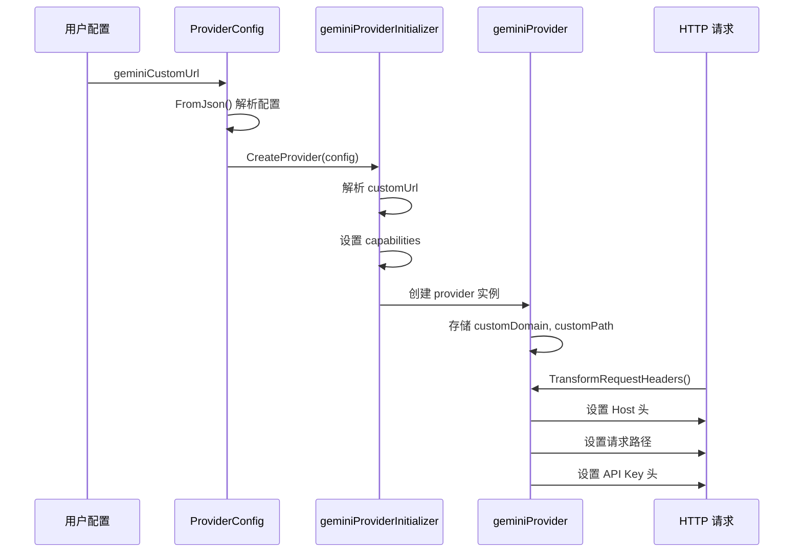

# Gemini Custom URL Support - 设计文档

## 概述

本设计文档描述了为 Gemini provider 添加自定义 URL 支持的实现方案。该功能允许用户通过配置参数指定自定义的 Gemini 服务地址，以便使用代理服务或镜像服务，而不是默认的官方域名 (generativelanguage.googleapis.com)。

该功能参考了 OpenAI 和 vLLM provider 中已有的 `openaiCustomUrl` 和 `vllmCustomUrl` 实现模式，为 Gemini provider 提供相同的灵活性和一致的用户体验。

### 设计目标

1. 允许用户配置自定义的 Gemini 服务 URL
2. 统一采用"域名替换 + 路径拼接"策略处理所有自定义 URL
3. 正确设置 HTTP Host 头以避免 421 错误
4. 保持与 OpenAI/vLLM provider 实现的一致性
5. 确保向后兼容性（未配置时使用默认行为）
6. 支持原生 Gemini 协议和 OpenAI 协议转换两种模式

### 核心概念

- **域名替换**: 使用自定义域名替换默认的 Gemini 官方域名
- **路径拼接**: 当配置包含路径前缀时，将自定义路径前缀与标准 API 路径拼接
- **Host 头匹配**: HTTP Host 头必须与实际请求的目标服务器域名一致，否则可能导致 421 (Misdirected Request) 错误
- **协议模式**: 通过 `protocol` 参数控制是否进行 OpenAI 到 Gemini 的协议转换
  - `protocol: "original"`: 透传原生 Gemini 协议，不做任何转换
  - `protocol: "openai"` 或未配置: 将 OpenAI 格式请求转换为 Gemini 格式

## 架构设计

### 整体架构

```
用户配置 (geminiCustomUrl)
    ↓
配置解析 (FromJson)
    ↓
Provider 创建 (CreateProvider)
    ↓ 解析 URL
    ├─ 移除协议前缀 (http://, https://)
    ├─ 分割域名和路径
    └─ 设置 capabilities
    ↓
请求处理 (TransformRequestHeaders)
    ├─ 设置 Host 头 (自定义域名或默认域名)
    ├─ 设置请求路径 (拼接路径)
    └─ 设置 API Key 头
```


### 组件交互



## 组件和接口

### 1. ProviderConfig 扩展

在 `ProviderConfig` 结构体中添加新字段：

```go
type ProviderConfig struct {
    // ... 现有字段 ...
    
    // @Title zh-CN Gemini 自定义后端 URL
    // @Description zh-CN 仅适用于 Gemini 服务。自定义的 Gemini 服务地址，用于代理或镜像服务
    geminiCustomUrl string `required:"false" yaml:"geminiCustomUrl" json:"geminiCustomUrl"`
}
```

添加 getter 方法：

```go
func (c *ProviderConfig) GetGeminiCustomUrl() string {
    return c.geminiCustomUrl
}
```

在 `FromJson` 方法中添加解析逻辑：

```go
func (c *ProviderConfig) FromJson(json gjson.Result) {
    // ... 现有解析逻辑 ...
    c.geminiCustomUrl = json.Get("geminiCustomUrl").String()
}
```

**关于 protocol 参数的说明**：

`protocol` 参数已经在现有的 `ProviderConfig` 中实现，通过 `IsOriginal()` 方法判断：
- 当 `protocol: "original"` 时，`IsOriginal()` 返回 true，在 `OnRequestBody` 方法中会跳过协议转换，直接透传请求
- 当 `protocol: "openai"` 或未配置时，`IsOriginal()` 返回 false，会执行 OpenAI 到 Gemini 的协议转换

本次自定义 URL 功能的实现与 protocol 参数完全独立，两者可以任意组合使用：
- 可以使用自定义 URL + 原生协议
- 可以使用自定义 URL + OpenAI 协议转换
- 可以使用默认 URL + 原生协议
- 可以使用默认 URL + OpenAI 协议转换

### 2. geminiProvider 结构体扩展

在 `geminiProvider` 结构体中添加新字段：

```go
type geminiProvider struct {
    config             ProviderConfig
    contextCache       *contextCache
    client             wrapper.HttpClient
    
    // 新增字段
    customDomain       string  // 自定义域名，如 "custom.gemini.com"
    customPath         string  // 自定义路径，如 "/custom/prefix" 或 "/"
}
```


### 3. CreateProvider 方法实现

修改 `geminiProviderInitializer.CreateProvider` 方法以支持自定义 URL：

```go
func (g *geminiProviderInitializer) CreateProvider(config ProviderConfig) (Provider, error) {
    // 如果未配置自定义 URL，使用默认配置
    if config.GetGeminiCustomUrl() == "" {
        config.setDefaultCapabilities(g.DefaultCapabilities())
        return &geminiProvider{
            config:       config,
            contextCache: createContextCache(&config),
            client: wrapper.NewClusterClient(wrapper.RouteCluster{
                Host: geminiDomain,
            }),
        }, nil
    }
    
    // 解析自定义 URL
    customUrl := strings.TrimPrefix(strings.TrimPrefix(config.GetGeminiCustomUrl(), "http://"), "https://")
    pairs := strings.SplitN(customUrl, "/", 2)
    customPath := "/"
    if len(pairs) == 2 {
        customPath += pairs[1]
    }
    
    // 设置 capabilities
    config.setDefaultCapabilities(g.DefaultCapabilities())
    
    log.Debugf("ai-proxy: gemini provider customDomain:%s, customPath:%s",
        pairs[0], customPath)
    
    return &geminiProvider{
        config:             config,
        contextCache:       createContextCache(&config),
        client: wrapper.NewClusterClient(wrapper.RouteCluster{
            Host: pairs[0],
        }),
        customDomain:       pairs[0],
        customPath:         customPath,
    }, nil
}
```

### 4. TransformRequestHeaders 方法修改

修改 `geminiProvider.TransformRequestHeaders` 方法以支持自定义域名和路径：

```go
func (g *geminiProvider) TransformRequestHeaders(ctx wrapper.HttpContext, apiName ApiName, headers http.Header) {
    // 设置 Host 头
    if g.customDomain != "" {
        util.OverwriteRequestHostHeader(headers, g.customDomain)
    } else {
        util.OverwriteRequestHostHeader(headers, geminiDomain)
    }
    
    // 设置 API Key 头（保持不变）
    headers.Set(geminiApiKeyHeader, g.config.GetApiTokenInUse(ctx))
    util.OverwriteRequestAuthorizationHeader(headers, "")
}
```

**关键设计决策**：
1. **Host 头设置**：根据是否配置了自定义域名来决定使用自定义域名还是默认域名
2. **路径处理**：Gemini 的路径是在 `getRequestPath` 方法中动态生成的，因此不在 `TransformRequestHeaders` 中处理路径
3. **API Key 保持不变**：无论是否使用自定义 URL，API Key 的设置逻辑保持不变

### 5. getRequestPath 方法修改

修改 `geminiProvider.getRequestPath` 方法以支持自定义路径：

```go
func (g *geminiProvider) getRequestPath(apiName ApiName, model string, stream bool) string {
    action := ""
    if g.config.apiVersion == "" {
        g.config.apiVersion = geminiDefaultApiVersion
    }
    
    switch apiName {
    case ApiNameModels:
        standardPath := fmt.Sprintf("/%s/%s", g.config.apiVersion, geminiModelsPath)
        // 如果有自定义路径，拼接自定义前缀和标准路径
        if g.customPath != "/" {
            return path.Join(g.customPath, standardPath)
        }
        return standardPath
        
    case ApiNameEmbeddings:
        action = geminiEmbeddingPath
    case ApiNameChatCompletion:
        if stream {
            action = geminiChatCompletionStreamPath
        } else {
            action = geminiChatCompletionPath
        }
    case ApiNameImageGeneration:
        action = geminiImageGenerationPath
    case ApiNameGeminiGenerateContent:
        action = geminiChatCompletionPath
    case ApiNameGeminiStreamGenerateContent:
        action = geminiChatCompletionStreamPath
    }
    
    // 构建标准路径: /{version}/models/{model}:{action}
    standardPath := fmt.Sprintf("/%s/models/%s:%s", g.config.apiVersion, model, action)
    
    // 如果有自定义路径，拼接自定义前缀和标准路径
    if g.customPath != "/" {
        return path.Join(g.customPath, standardPath)
    }
    
    return standardPath
}
```

**设计说明**：
- **统一路径拼接**：所有情况下都使用相同的逻辑 - 如果有自定义路径前缀，就拼接；否则使用标准路径
- **简化逻辑**：不再区分直接路径和间接路径，统一处理
- **示例**：
  - customPath=`/api/v1` + standardPath=`/v1beta/models/gemini-pro:generateContent` = `/api/v1/v1beta/models/gemini-pro:generateContent`
  - customPath=`/` + standardPath=`/v1beta/models/gemini-pro:generateContent` = `/v1beta/models/gemini-pro:generateContent`


## 数据模型

### 配置数据流

```
用户配置 YAML/JSON
{
  "geminiCustomUrl": "https://custom.gemini.com/api/v1"
}
    ↓
ProviderConfig.geminiCustomUrl = "https://custom.gemini.com/api/v1"
    ↓
解析后
customDomain = "custom.gemini.com"
customPath = "/api/v1"
```

### URL 解析示例

| 输入 URL | customDomain | customPath |
|---------|--------------|------------|
| `custom.gemini.com` | `custom.gemini.com` | `/` |
| `custom.gemini.com/api` | `custom.gemini.com` | `/api` |
| `custom.gemini.com/v1/models` | `custom.gemini.com` | `/v1/models` |
| `custom.gemini.com/v1beta/models` | `custom.gemini.com` | `/v1beta/models` |
| `https://api.aportal.ai/v1/models` | `api.aportal.ai` | `/v1/models` |
| `https://proxy.example.com/gemini` | `proxy.example.com` | `/gemini` |
| `http://localhost:8080/v1/providerabc` | `localhost:8080` | `/v1/providerabc` |

### 路径拼接示例

**场景 1：仅域名配置（customPath = "/"）**
- customPath: `/`
- 标准路径: `/v1beta/models/gemini-pro:generateContent`
- 最终路径: `/v1beta/models/gemini-pro:generateContent`

**场景 2：带路径前缀配置**
- customPath: `/api/v1`
- 标准路径: `/v1beta/models/gemini-pro:generateContent`
- 最终路径: `/api/v1/v1beta/models/gemini-pro:generateContent`

**场景 3：带 /models 的路径前缀**
- customPath: `/v1/provider`
- 标准路径: `/v1beta/models/gemini-pro:generateContent`
- 最终路径: `/v1/provider/v1beta/models/gemini-pro:generateContent`

**场景 4：默认配置（无 customUrl）**
- customPath: 未设置
- 标准路径: `/v1beta/models/gemini-pro:generateContent`
- 最终路径: `/v1beta/models/gemini-pro:generateContent`

## 正确性属性

*属性是一个特征或行为，应该在系统的所有有效执行中保持为真——本质上是关于系统应该做什么的形式化陈述。属性作为人类可读规范和机器可验证正确性保证之间的桥梁。*

### 属性 1：配置解析和存储

*对于任何* 有效的配置 JSON，当调用 `FromJson` 方法并提供 `geminiCustomUrl` 参数时，该值应该被正确解析并存储在 `ProviderConfig.geminiCustomUrl` 字段中，且可以通过 `GetGeminiCustomUrl()` 方法获取相同的值。

**验证需求**: 1.2

### 属性 2：协议前缀移除

*对于任何* 包含 "http://" 或 "https://" 协议前缀的自定义 URL，解析后的 `customDomain` 和 `customPath` 不应包含这些协议前缀。

**验证需求**: 2.1

### 属性 3：URL 分割正确性

*对于任何* 包含路径的自定义 URL（格式为 "domain/path"），解析后应该正确分割为 `customDomain`（第一个 "/" 之前的部分）和 `customPath`（"/" 及之后的部分）。

**验证需求**: 2.2

### 属性 4：默认路径设置

*对于任何* 仅包含域名的自定义 URL（不包含 "/"），解析后的 `customPath` 应该被设置为 "/"。

**验证需求**: 2.3


### 属性 5：路径拼接正确性

*对于任何* 配置了自定义路径前缀的情况（`customPath` 不为 "/"），`getRequestPath` 方法返回的最终路径应该是 `customPath` 与标准 API 路径的完整拼接结果。

**验证需求**: 2.4, 2.5, 3.5

**示例**：customPath=`/api/v1` + 标准路径=`/v1beta/models/gemini-pro:generateContent` = `/api/v1/v1beta/models/gemini-pro:generateContent`

### 属性 6：Host 头与自定义域名匹配

*对于任何* 配置了自定义域名的情况（`customDomain` 不为空），`TransformRequestHeaders` 方法应该将 HTTP Host 头设置为 `customDomain` 的值。

**验证需求**: 3.1, 6.1, 6.4, 6.5

### 属性 7：Host 头与目标域名一致性

*对于任何* provider 配置，`TransformRequestHeaders` 方法设置的 Host 头应该与实际请求的目标服务器域名一致（自定义域名或默认域名）。

**验证需求**: 3.3, 6.3

### 属性 8：API Key 设置不变性

*对于任何* provider 配置（无论是否配置了自定义 URL），`TransformRequestHeaders` 方法应该使用相同的逻辑设置 API Key 头（`x-goog-api-key`），其值应该来自 `config.GetApiTokenInUse(ctx)`。

**验证需求**: 3.6, 8.3

### 属性 9：Provider 字段存储

*对于任何* 非空的自定义 URL 配置，`CreateProvider` 方法创建的 provider 实例应该正确存储解析后的 `customDomain` 和 `customPath` 字段。

**验证需求**: 4.2, 4.3

### 属性 10：Capabilities 设置

*对于任何* provider 配置，`CreateProvider` 方法应该调用 `config.setDefaultCapabilities` 设置 capabilities 映射。

**验证需求**: 4.4

### 属性 11：URL 格式验证

*对于任何* 配置的 `geminiCustomUrl`，系统应该能够解析它而不会导致程序崩溃（即使格式不完全标准）。

**验证需求**: 7.1

## 错误处理

### 错误场景和处理策略

1. **空配置**
   - 场景：`geminiCustomUrl` 未配置或为空字符串
   - 处理：使用默认域名 `generativelanguage.googleapis.com` 和标准路径
   - 验证：示例测试

2. **无效 URL 格式**
   - 场景：URL 格式不符合预期（如包含特殊字符、格式错误等）
   - 处理：尽可能解析，记录警告日志，但不阻止 provider 创建
   - 验证：边界测试

3. **Host 头不匹配导致的 421 错误**
   - 场景：Host 头与实际目标服务器不匹配
   - 预防：确保 Host 头始终设置为实际请求的目标域名
   - 验证：属性测试（属性 6 和 7）

4. **路径拼接错误**
   - 场景：路径拼接导致的路径格式错误
   - 预防：使用 `path.Join` 函数确保路径格式正确
   - 验证：属性测试（属性 5）


### 日志记录

在关键步骤添加调试日志：

```go
// 在 CreateProvider 中
log.Debugf("ai-proxy: gemini provider customDomain:%s, customPath:%s",
    pairs[0], customPath)

// 在 TransformRequestHeaders 中（可选）
log.Debugf("ai-proxy: gemini provider setting Host header to: %s", hostHeader)

// 在 getRequestPath 中（可选）
log.Debugf("ai-proxy: gemini provider generated path: %s for apiName: %s", finalPath, apiName)
```

## 测试策略

### 双重测试方法

本功能采用单元测试和基于属性的测试相结合的方法：

- **单元测试**：验证特定示例、边界情况和错误条件
- **属性测试**：通过随机化输入验证通用属性

两者互补，共同确保全面覆盖：
- 单元测试捕获具体的 bug
- 属性测试验证通用正确性

### 单元测试用例

#### 1. 基本功能测试

**测试用例 1.1：未配置自定义 URL**
```go
func TestGeminiProvider_NoCustomUrl(t *testing.T) {
    config := ProviderConfig{}
    provider, err := CreateProvider(config)
    
    assert.NoError(t, err)
    geminiProvider := provider.(*geminiProvider)
    assert.Equal(t, "", geminiProvider.customDomain)
    assert.Equal(t, "", geminiProvider.customPath)
    
    // 验证 Host 头使用默认域名
    headers := http.Header{}
    geminiProvider.TransformRequestHeaders(ctx, ApiNameChatCompletion, headers)
    assert.Equal(t, geminiDomain, headers.Get("Host"))
}
```

**测试用例 1.2：基本自定义域名**
```go
func TestGeminiProvider_CustomDomain(t *testing.T) {
    config := ProviderConfig{
        geminiCustomUrl: "custom.gemini.com",
    }
    provider, err := CreateProvider(config)
    
    assert.NoError(t, err)
    geminiProvider := provider.(*geminiProvider)
    assert.Equal(t, "custom.gemini.com", geminiProvider.customDomain)
    assert.Equal(t, "/", geminiProvider.customPath)
}
```

**测试用例 1.3：带协议前缀的 URL**
```go
func TestGeminiProvider_UrlWithProtocol(t *testing.T) {
    testCases := []struct {
        input    string
        expected string
    }{
        {"https://custom.gemini.com", "custom.gemini.com"},
        {"http://custom.gemini.com", "custom.gemini.com"},
        {"https://custom.gemini.com/api", "custom.gemini.com"},
    }
    
    for _, tc := range testCases {
        config := ProviderConfig{geminiCustomUrl: tc.input}
        provider, _ := CreateProvider(config)
        geminiProvider := provider.(*geminiProvider)
        assert.Equal(t, tc.expected, geminiProvider.customDomain)
    }
}
```


#### 2. 路径处理测试

**测试用例 2.1：带路径前缀配置**
```go
func TestGeminiProvider_PathPrefix(t *testing.T) {
    config := ProviderConfig{
        geminiCustomUrl: "custom.gemini.com/api/v1",
    }
    provider, err := CreateProvider(config)
    
    assert.NoError(t, err)
    geminiProvider := provider.(*geminiProvider)
    assert.Equal(t, "custom.gemini.com", geminiProvider.customDomain)
    assert.Equal(t, "/api/v1", geminiProvider.customPath)
    
    // 验证路径拼接
    path := geminiProvider.getRequestPath(ApiNameChatCompletion, "gemini-pro", false)
    assert.Contains(t, path, "/api/v1")
    assert.Contains(t, path, "generateContent")
}
```

**测试用例 2.2：仅域名配置**
```go
func TestGeminiProvider_DomainOnly(t *testing.T) {
    config := ProviderConfig{
        geminiCustomUrl: "custom.gemini.com",
    }
    provider, err := CreateProvider(config)
    
    assert.NoError(t, err)
    geminiProvider := provider.(*geminiProvider)
    assert.Equal(t, "custom.gemini.com", geminiProvider.customDomain)
    assert.Equal(t, "/", geminiProvider.customPath)
    
    // 验证路径：应该直接使用标准路径
    path := geminiProvider.getRequestPath(ApiNameChatCompletion, "gemini-pro", false)
    assert.Contains(t, path, "/v1")
    assert.Contains(t, path, "models")
    assert.Contains(t, path, "generateContent")
}
```

#### 3. Host 头设置测试

**测试用例 3.1：自定义域名的 Host 头**
```go
func TestGeminiProvider_CustomDomainHostHeader(t *testing.T) {
    config := ProviderConfig{
        geminiCustomUrl: "custom.gemini.com/api",
    }
    provider, _ := CreateProvider(config)
    geminiProvider := provider.(*geminiProvider)
    
    headers := http.Header{}
    geminiProvider.TransformRequestHeaders(ctx, ApiNameChatCompletion, headers)
    
    assert.Equal(t, "custom.gemini.com", headers.Get("Host"))
}
```

**测试用例 3.2：默认域名的 Host 头**
```go
func TestGeminiProvider_DefaultDomainHostHeader(t *testing.T) {
    config := ProviderConfig{}
    provider, _ := CreateProvider(config)
    geminiProvider := provider.(*geminiProvider)
    
    headers := http.Header{}
    geminiProvider.TransformRequestHeaders(ctx, ApiNameChatCompletion, headers)
    
    assert.Equal(t, geminiDomain, headers.Get("Host"))
}
```


#### 4. API Key 设置测试

**测试用例 4.1：API Key 设置不变性**
```go
func TestGeminiProvider_ApiKeyUnchanged(t *testing.T) {
    testCases := []struct {
        name      string
        customUrl string
    }{
        {"no custom url", ""},
        {"with custom url", "custom.gemini.com"},
        {"with custom path", "custom.gemini.com/api"},
    }
    
    for _, tc := range testCases {
        t.Run(tc.name, func(t *testing.T) {
            config := ProviderConfig{
                geminiCustomUrl: tc.customUrl,
                apiTokens:       []string{"test-api-key"},
            }
            provider, _ := CreateProvider(config)
            geminiProvider := provider.(*geminiProvider)
            
            headers := http.Header{}
            geminiProvider.TransformRequestHeaders(ctx, ApiNameChatCompletion, headers)
            
            // 验证 API Key 头被正确设置
            assert.NotEmpty(t, headers.Get(geminiApiKeyHeader))
        })
    }
}
```

#### 5. 边界情况测试

**测试用例 5.1：空字符串配置**
```go
func TestGeminiProvider_EmptyCustomUrl(t *testing.T) {
    config := ProviderConfig{
        geminiCustomUrl: "",
    }
    provider, err := CreateProvider(config)
    
    assert.NoError(t, err)
    geminiProvider := provider.(*geminiProvider)
    assert.Equal(t, "", geminiProvider.customDomain)
}
```

**测试用例 5.2：仅包含协议的 URL**
```go
func TestGeminiProvider_ProtocolOnly(t *testing.T) {
    config := ProviderConfig{
        geminiCustomUrl: "https://",
    }
    provider, err := CreateProvider(config)
    
    // 应该能够处理而不崩溃
    assert.NoError(t, err)
}
```

### 基于属性的测试

使用 Go 的 `testing/quick` 包或第三方库（如 `gopter`）进行基于属性的测试。

#### 属性测试配置

- 每个属性测试至少运行 100 次迭代
- 每个测试用例使用注释标记对应的设计文档属性
- 标记格式：`// Feature: gemini-custom-url-support, Property {number}: {property_text}`

#### 属性测试示例

**属性测试 1：协议前缀移除**
```go
// Feature: gemini-custom-url-support, Property 2: 协议前缀移除
func TestProperty_ProtocolPrefixRemoval(t *testing.T) {
    property := func(domain string, hasHttps bool, hasHttp bool) bool {
        // 构造带协议前缀的 URL
        url := domain
        if hasHttps {
            url = "https://" + url
        } else if hasHttp {
            url = "http://" + url
        }
        
        config := ProviderConfig{geminiCustomUrl: url}
        provider, err := CreateProvider(config)
        if err != nil {
            return false
        }
        
        geminiProvider := provider.(*geminiProvider)
        // 验证 customDomain 不包含协议前缀
        return !strings.Contains(geminiProvider.customDomain, "http://") &&
               !strings.Contains(geminiProvider.customDomain, "https://")
    }
    
    if err := quick.Check(property, &quick.Config{MaxCount: 100}); err != nil {
        t.Error(err)
    }
}
```


**属性测试 2：URL 分割正确性**
```go
// Feature: gemini-custom-url-support, Property 3: URL 分割正确性
func TestProperty_UrlSplitting(t *testing.T) {
    property := func(domain string, path string) bool {
        // 跳过空字符串
        if domain == "" {
            return true
        }
        
        // 构造 URL
        url := domain
        if path != "" {
            url = domain + "/" + strings.TrimPrefix(path, "/")
        }
        
        config := ProviderConfig{geminiCustomUrl: url}
        provider, err := CreateProvider(config)
        if err != nil {
            return false
        }
        
        geminiProvider := provider.(*geminiProvider)
        
        // 验证域名部分正确
        if !strings.Contains(url, "/") {
            return geminiProvider.customDomain == domain
        }
        
        // 验证域名和路径分割正确
        expectedDomain := strings.Split(url, "/")[0]
        return geminiProvider.customDomain == expectedDomain &&
               strings.HasPrefix(geminiProvider.customPath, "/")
    }
    
    if err := quick.Check(property, &quick.Config{MaxCount: 100}); err != nil {
        t.Error(err)
    }
}
```

**属性测试 3：Host 头与自定义域名匹配**
```go
// Feature: gemini-custom-url-support, Property 7: Host 头与自定义域名匹配
func TestProperty_HostHeaderMatchesCustomDomain(t *testing.T) {
    property := func(domain string) bool {
        // 跳过空字符串
        if domain == "" {
            return true
        }
        
        config := ProviderConfig{
            geminiCustomUrl: domain,
            apiTokens:       []string{"test-key"},
        }
        provider, err := CreateProvider(config)
        if err != nil {
            return false
        }
        
        geminiProvider := provider.(*geminiProvider)
        if geminiProvider.customDomain == "" {
            return true
        }
        
        headers := http.Header{}
        ctx := &mockHttpContext{}
        geminiProvider.TransformRequestHeaders(ctx, ApiNameChatCompletion, headers)
        
        // 验证 Host 头与自定义域名匹配
        return headers.Get("Host") == geminiProvider.customDomain
    }
    
    if err := quick.Check(property, &quick.Config{MaxCount: 100}); err != nil {
        t.Error(err)
    }
}
```

**属性测试 4：路径拼接正确性**
```go
// Feature: gemini-custom-url-support, Property 5: 路径拼接正确性
func TestProperty_PathConcatenation(t *testing.T) {
    property := func(customPrefix string) bool {
        // 跳过空字符串
        if customPrefix == "" {
            return true
        }
        
        url := "custom.gemini.com/" + strings.TrimPrefix(customPrefix, "/")
        config := ProviderConfig{geminiCustomUrl: url}
        provider, err := CreateProvider(config)
        if err != nil {
            return false
        }
        
        geminiProvider := provider.(*geminiProvider)
        
        // 获取生成的路径
        generatedPath := geminiProvider.getRequestPath(ApiNameChatCompletion, "gemini-pro", false)
        
        // 如果有自定义路径前缀，验证生成的路径包含自定义前缀
        if geminiProvider.customPath != "/" {
            return strings.HasPrefix(generatedPath, geminiProvider.customPath)
        }
        
        // 如果没有自定义路径前缀，验证使用标准路径
        return strings.Contains(generatedPath, "/models/")
    }
    
    if err := quick.Check(property, &quick.Config{MaxCount: 100}); err != nil {
        t.Error(err)
    }
}
```

**属性测试 5：API Key 设置不变性**
```go
// Feature: gemini-custom-url-support, Property 8: API Key 设置不变性
func TestProperty_ApiKeyInvariance(t *testing.T) {
    property := func(customUrl string, apiKey string) bool {
        // 跳过空 API Key
        if apiKey == "" {
            apiKey = "test-key"
        }
        
        config := ProviderConfig{
            geminiCustomUrl: customUrl,
            apiTokens:       []string{apiKey},
        }
        provider, err := CreateProvider(config)
        if err != nil {
            return false
        }
        
        geminiProvider := provider.(*geminiProvider)
        headers := http.Header{}
        ctx := &mockHttpContext{}
        geminiProvider.TransformRequestHeaders(ctx, ApiNameChatCompletion, headers)
        
        // 验证 API Key 头被设置
        return headers.Get(geminiApiKeyHeader) != ""
    }
    
    if err := quick.Check(property, &quick.Config{MaxCount: 100}); err != nil {
        t.Error(err)
    }
}
```

### 集成测试

除了单元测试和属性测试，还应该进行集成测试以验证端到端的功能：

**集成测试 1：完整请求流程**
```go
func TestIntegration_CustomUrlEndToEnd(t *testing.T) {
    // 设置测试服务器
    testServer := httptest.NewServer(http.HandlerFunc(func(w http.ResponseWriter, r *http.Request) {
        // 验证 Host 头
        assert.Equal(t, "custom.gemini.com", r.Host)
        // 验证路径
        assert.Contains(t, r.URL.Path, "/api/v1")
        // 验证 API Key
        assert.NotEmpty(t, r.Header.Get(geminiApiKeyHeader))
        
        w.WriteHeader(http.StatusOK)
        w.Write([]byte(`{"candidates": []}`))
    }))
    defer testServer.Close()
    
    // 配置 provider
    config := ProviderConfig{
        geminiCustomUrl: "custom.gemini.com/api/v1",
        apiTokens:       []string{"test-key"},
    }
    
    // 执行完整的请求流程
    // ... 测试代码 ...
}
```

### 测试覆盖率目标

- 代码覆盖率：≥ 80%
- 分支覆盖率：≥ 75%
- 属性测试迭代次数：≥ 100 次/属性


## 实现细节

### 代码修改清单

#### 1. provider.go

**位置**: `plugins/wasm-go/extensions/ai-proxy/provider/provider.go`

**修改内容**:
```go
// 在 ProviderConfig 结构体中添加字段（约第 315 行）
type ProviderConfig struct {
    // ... 现有字段 ...
    
    // @Title zh-CN Gemini 自定义后端 URL
    // @Description zh-CN 仅适用于 Gemini 服务。自定义的 Gemini 服务地址，用于代理或镜像服务
    geminiCustomUrl string `required:"false" yaml:"geminiCustomUrl" json:"geminiCustomUrl"`
}

// 在 GetVllmCustomUrl 方法后添加新方法（约第 480 行）
func (c *ProviderConfig) GetGeminiCustomUrl() string {
    return c.geminiCustomUrl
}

// 在 FromJson 方法中添加解析逻辑（约第 505 行）
func (c *ProviderConfig) FromJson(json gjson.Result) {
    // ... 现有解析逻辑 ...
    c.geminiCustomUrl = json.Get("geminiCustomUrl").String()
}
```

#### 2. gemini.go

**位置**: `plugins/wasm-go/extensions/ai-proxy/provider/gemini.go`

**修改内容**:

**2.1 修改 geminiProvider 结构体**（约第 70 行）
```go
type geminiProvider struct {
    config             ProviderConfig
    contextCache       *contextCache
    client             wrapper.HttpClient
    
    // 新增字段
    customDomain       string
    customPath         string
}
```

**2.2 修改 CreateProvider 方法**（约第 63 行）
```go
func (g *geminiProviderInitializer) CreateProvider(config ProviderConfig) (Provider, error) {
    // 如果未配置自定义 URL，使用默认配置
    if config.GetGeminiCustomUrl() == "" {
        config.setDefaultCapabilities(g.DefaultCapabilities())
        return &geminiProvider{
            config:       config,
            contextCache: createContextCache(&config),
            client: wrapper.NewClusterClient(wrapper.RouteCluster{
                Host: geminiDomain,
            }),
        }, nil
    }
    
    // 解析自定义 URL
    customUrl := strings.TrimPrefix(strings.TrimPrefix(config.GetGeminiCustomUrl(), "http://"), "https://")
    pairs := strings.SplitN(customUrl, "/", 2)
    customPath := "/"
    if len(pairs) == 2 {
        customPath += pairs[1]
    }
    
    // 设置 capabilities
    config.setDefaultCapabilities(g.DefaultCapabilities())
    
    log.Debugf("ai-proxy: gemini provider customDomain:%s, customPath:%s",
        pairs[0], customPath)
    
    return &geminiProvider{
        config:             config,
        contextCache:       createContextCache(&config),
        client: wrapper.NewClusterClient(wrapper.RouteCluster{
            Host: pairs[0],
        }),
        customDomain:       pairs[0],
        customPath:         customPath,
    }, nil
}
```

**2.3 修改 TransformRequestHeaders 方法**（约第 91 行）
```go
func (g *geminiProvider) TransformRequestHeaders(ctx wrapper.HttpContext, apiName ApiName, headers http.Header) {
    // 设置 Host 头
    if g.customDomain != "" {
        util.OverwriteRequestHostHeader(headers, g.customDomain)
    } else {
        util.OverwriteRequestHostHeader(headers, geminiDomain)
    }
    
    // 设置 API Key 头（保持不变）
    headers.Set(geminiApiKeyHeader, g.config.GetApiTokenInUse(ctx))
    util.OverwriteRequestAuthorizationHeader(headers, "")
}
```

**2.4 修改 getRequestPath 方法**（约第 300 行）
```go
func (g *geminiProvider) getRequestPath(apiName ApiName, model string, stream bool) string {
    action := ""
    if g.config.apiVersion == "" {
        g.config.apiVersion = geminiDefaultApiVersion
    }
    
    switch apiName {
    case ApiNameModels:
        standardPath := fmt.Sprintf("/%s/%s", g.config.apiVersion, geminiModelsPath)
        // 如果有自定义路径，拼接自定义前缀和标准路径
        if g.customPath != "/" {
            return path.Join(g.customPath, standardPath)
        }
        return standardPath
        
    case ApiNameEmbeddings:
        action = geminiEmbeddingPath
    case ApiNameChatCompletion:
        if stream {
            action = geminiChatCompletionStreamPath
        } else {
            action = geminiChatCompletionPath
        }
    case ApiNameImageGeneration:
        action = geminiImageGenerationPath
    case ApiNameGeminiGenerateContent:
        action = geminiChatCompletionPath
    case ApiNameGeminiStreamGenerateContent:
        action = geminiChatCompletionStreamPath
    }
    
    // 构建标准路径: /{version}/models/{model}:{action}
    standardPath := fmt.Sprintf("/%s/models/%s:%s", g.config.apiVersion, model, action)
    
    // 如果有自定义路径，拼接自定义前缀和标准路径
    if g.customPath != "/" {
        return path.Join(g.customPath, standardPath)
    }
    
    return standardPath
}
```

**2.5 添加必要的 import**（文件顶部）
```go
import (
    // ... 现有 imports ...
    "path"  // 如果尚未导入
)
```

### 实现注意事项

1. **路径拼接**：使用 `path.Join` 而不是字符串拼接，以确保路径格式正确
2. **协议处理**：先移除 "https://"，再移除 "http://"，以处理可能的嵌套情况
3. **空值检查**：在使用 `customDomain` 和 `customPath` 之前检查是否为空
4. **日志记录**：在关键步骤添加调试日志，便于问题排查
5. **向后兼容**：确保未配置 `geminiCustomUrl` 时的行为与现有实现完全一致

### 性能考虑

1. **URL 解析**：URL 解析只在 provider 创建时执行一次，不影响运行时性能
2. **路径生成**：`getRequestPath` 方法在每次请求时调用，但逻辑简单，性能影响可忽略
3. **内存占用**：每个 provider 实例增加 2 个字段（2 个字符串），内存增加约 32-40 字节


## 配置示例

### 示例 1：基本自定义域名

```yaml
providers:
  - id: gemini-custom
    type: gemini
    apiTokens:
      - "your-api-key"
    geminiCustomUrl: "custom.gemini.com"
```

**效果**：
- 请求将发送到 `custom.gemini.com`
- Host 头设置为 `custom.gemini.com`
- 使用标准的 Gemini API 路径

### 示例 2：带自定义路径前缀

```yaml
providers:
  - id: gemini-proxy
    type: gemini
    apiTokens:
      - "your-api-key"
    geminiCustomUrl: "https://proxy.example.com/gemini/api"
```

**效果**：
- 请求将发送到 `proxy.example.com`
- Host 头设置为 `proxy.example.com`
- 路径将包含 `/gemini/api` 前缀
- 例如：`/gemini/api/v1beta/models/gemini-pro:generateContent`

### 示例 3：本地开发环境

```yaml
providers:
  - id: gemini-local
    type: gemini
    apiTokens:
      - "test-key"
    geminiCustomUrl: "http://localhost:8080/gemini"
```

**效果**：
- 请求将发送到 `localhost:8080`
- Host 头设置为 `localhost:8080`
- 路径将包含 `/gemini` 前缀

## 兼容性和迁移

### 向后兼容性

1. **现有配置不受影响**：未配置 `geminiCustomUrl` 的现有部署将继续使用默认域名和路径
2. **API 保持不变**：不影响现有的 API 接口和行为
3. **配置可选**：`geminiCustomUrl` 是可选配置，不是必需的

### 迁移指南

对于希望使用自定义 URL 的用户：

1. **确定目标 URL**：确认代理服务或镜像服务的完整 URL
2. **更新配置**：在 provider 配置中添加 `geminiCustomUrl` 字段
3. **测试连接**：使用简单的请求测试连接是否正常
4. **验证 Host 头**：确认 Host 头设置正确，避免 421 错误
5. **监控日志**：检查日志中的调试信息，确认配置生效

### 与 OpenAI/vLLM 的一致性

本实现与 OpenAI 和 vLLM provider 的 customUrl 实现保持一致：

| 特性 | OpenAI | vLLM | Gemini (本设计) |
|------|--------|------|----------------|
| 配置字段名 | `openaiCustomUrl` | `vllmCustomUrl` | `geminiCustomUrl` |
| 协议前缀移除 | ✓ | ✓ | ✓ |
| 域名/路径分割 | ✓ | ✓ | ✓ |
| 路径拼接 | ✓ | ✓ | ✓ |
| Host 头设置 | ✓ | ✓ | ✓ |
| 向后兼容 | ✓ | ✓ | ✓ |


## 安全考虑

### 1. URL 验证

虽然系统会尽可能解析各种格式的 URL，但应该注意：

- **不验证 SSL 证书**：自定义域名可能使用自签名证书，需要在网关层面配置
- **不验证域名有效性**：系统不会检查域名是否可解析或可访问
- **不过滤特殊字符**：URL 中的特殊字符可能导致解析错误

### 2. API Key 安全

- API Key 的处理逻辑保持不变，不受自定义 URL 影响
- 建议使用 HTTPS 协议保护 API Key 传输
- 自定义域名应该是可信的服务

### 3. Host 头注入防护

- Host 头由系统自动设置，不接受用户输入
- 避免了 Host 头注入攻击的风险

## 限制和已知问题

### 当前限制

1. **单一自定义 URL**：每个 provider 实例只能配置一个自定义 URL
2. **路径格式固定**：Gemini 的路径格式为 `/{version}/models/{model}:{action}`，不支持其他格式
3. **不支持动态切换**：运行时不能动态切换自定义 URL，需要重新创建 provider

### 已知问题

1. **路径拼接的边界情况**：某些特殊的路径组合可能导致意外的拼接结果

### 未来改进方向

1. **支持多个自定义 URL**：为不同的 API 配置不同的自定义 URL
2. **URL 格式验证**：添加更严格的 URL 格式验证，提前发现配置错误
3. **动态配置更新**：支持运行时更新自定义 URL 配置

## 参考资料

### 相关代码

- OpenAI provider 实现：`plugins/wasm-go/extensions/ai-proxy/provider/openai.go`
- vLLM provider 实现：`plugins/wasm-go/extensions/ai-proxy/provider/vllm.go`
- Provider 配置：`plugins/wasm-go/extensions/ai-proxy/provider/provider.go`

### 相关文档

- Gemini API 文档：https://ai.google.dev/api/rest
- HTTP 421 状态码：https://developer.mozilla.org/en-US/docs/Web/HTTP/Status/421
- Go path 包文档：https://pkg.go.dev/path

### 设计决策记录

1. **为什么采用统一的路径拼接策略？**
   - 简化实现逻辑，减少代码复杂度
   - 所有自定义路径前缀都采用相同的处理方式，更容易理解和维护
   - 避免了区分直接路径和间接路径带来的额外判断逻辑

2. **为什么不在 `TransformRequestHeaders` 中处理路径？**
   - Gemini 的路径是动态生成的，依赖于模型名称和操作类型
   - 路径生成逻辑已经在 `getRequestPath` 方法中实现

3. **为什么 Gemini 的 capabilities 值为空字符串？**
   - Gemini 的路径格式与 OpenAI 不同，无法预先定义固定的路径映射
   - 路径在运行时根据模型和操作动态生成

4. **自定义 URL 的路径拼接规则**
   
   采用统一的"域名替换 + 路径拼接"策略，不区分直接路径和间接路径：
   
   - **配置仅域名**：`aaa.xxx.com`
     - customPath = `/`
     - 用户请求路径：`/v1beta/models/gemini-pro:generateContent`
     - 最终路径：`/v1beta/models/gemini-pro:generateContent`（保持原路径）
   
   - **配置域名+端口**：`aaa.xxx.com:8080`
     - customPath = `/`
     - 用户请求路径：`/v1beta/models/gemini-pro:generateContent`
     - 最终路径：`/v1beta/models/gemini-pro:generateContent`（保持原路径）
   
   - **配置域名+路径前缀**：`aaa.xxx.com/v1/provider`
     - customPath = `/v1/provider`
     - 用户请求路径：`/v1beta/models/gemini-pro:generateContent`
     - 最终路径：`/v1/provider/v1beta/models/gemini-pro:generateContent`（拼接路径）
   
   这种统一策略简化了实现逻辑，所有情况都使用相同的判断：如果 customPath != "/"，则使用 path.Join 拼接；否则直接使用标准路径。

5. **protocol 参数与自定义 URL 的关系**
   
   protocol 参数控制协议转换行为，与自定义 URL 功能完全独立：
   
   - `protocol: "original"` + `geminiCustomUrl`: 使用自定义 URL，透传原生 Gemini 协议
   - `protocol: "openai"` + `geminiCustomUrl`: 使用自定义 URL，进行 OpenAI 到 Gemini 的协议转换
   - 未配置 `geminiCustomUrl`: 使用默认官方域名，protocol 参数仍然生效
   
   在 `OnRequestBody` 方法中，通过 `config.IsOriginal()` 判断是否跳过协议转换，这个逻辑在自定义 URL 功能实现后保持不变。

## 附录

### A. 完整的代码差异

详细的代码修改可以参考实现细节部分。

### B. 测试用例清单

| 测试类型 | 测试用例数量 | 覆盖的需求 |
|---------|------------|----------|
| 单元测试 | 15+ | 所有功能需求 |
| 属性测试 | 6 | 核心属性 |
| 集成测试 | 1 | 端到端流程 |

### C. 术语对照表

| 中文术语 | 英文术语 | 说明 |
|---------|---------|------|
| 自定义 URL | Custom URL | 用户配置的服务地址 |
| 路径前缀 | Path Prefix | 自定义路径前缀，需要与标准路径拼接 |
| Host 头 | Host Header | HTTP 请求头中的 Host 字段 |
| 421 错误 | 421 Error | Misdirected Request 错误 |

---

**文档版本**: 1.0  
**创建日期**: 2024  
**最后更新**: 2024  
**作者**: Kiro AI Assistant
